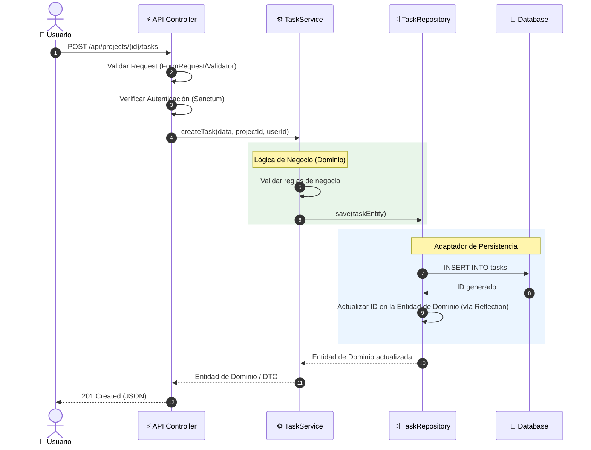

# Iyata API - Backend

> **📌 Nota:** Este repositorio contiene el **Backend (API RESTful)** del proyecto.  
> 🔗 **Información del proyecto:** [Prueba técnica](https://github.com/MartinCiro/algorithms_test)

API RESTful construida con Laravel, diseñada bajo los principios de **Arquitectura Hexagonal (Ports & Adapters)** y **Domain-Driven Design (DDD)** para garantizar un código escalable, mantenible y con una clara separación de responsabilidades.

---

## 🚀 Características

- **Arquitectura Hexagonal**: Separación estricta entre el dominio, la aplicación y la infraestructura.
- **Domain-Driven Design (DDD)**: Uso de Entidades, Value Objects y Enums para modelar el negocio con precisión.
- **Autenticación Segura**: Implementación de Laravel Sanctum para gestión de tokens API.
- **Gestión de Proyectos y Tareas**: CRUD completo con máquinas de estado personalizadas y fechas de vencimiento.
- **Dockerizado**: Entorno de desarrollo y producción reproducible con Docker Compose (PHP 8.2, MariaDB, Queue Worker).
- **Inyección de Dependencias**: Bindings centralizados en `AppServiceProvider` para facilitar el testing y el mantenimiento.

---

## 🏗️ Arquitectura del Sistema

```mermaid
graph TB
    subgraph Cliente["🌐 Cliente (Frontend / Postman)"]
        Client[HTTP/JSON Requests]
    end

    subgraph API["⚡ Laravel API Layer"]
        Routes[routes/api.php]
        Middleware[Middleware: auth:sanctum]
        Controllers[Api Controllers]
        Client --> Routes --> Middleware --> Controllers
    end

    subgraph Core["🧠 Core (Dominio y Aplicación)"]
        Services[Application Services<br/>(Casos de Uso)]
        Ports[Ports<br/>(Interfaces/Contratos)]
        Controllers --> Services
        Services --> Ports
    end

    subgraph Infrastructure["🏗️ Infraestructura (Adaptadores)"]
        Repositories[Eloquent Repositories]
        Models[Eloquent Models]
        DB[("💾 MariaDB")]
        
        Ports -.->|Implementa| Repositories
        Repositories --> Models
        Models --> DB
    end

    style Core fill:#ffe4e6,stroke:#be123c,stroke-width:2px
    style Infrastructure fill:#dbeafe,stroke:#1d4ed8,stroke-width:2px
    style API fill:#fef3c7,stroke:#ca8a04,stroke-width:2px
```

---

## 📂 Estructura del Proyecto

La estructura sigue estrictamente los principios de DDD y Arquitectura Hexagonal:

```text
.
├── app/
│   ├── Core/                           # Capa de Dominio y Aplicación (Independiente de Laravel)
│   │   ├── Projects/
│   │   │   ├── Domain/                 # Entidades, Value Objects y Enums (Project, ProjectId, ProjectStatus)
│   │   │   ├── Application/            # Casos de uso y servicios de aplicación (ProjectService)
│   │   │   └── Ports/                  # Interfaces (ProjectRepositoryInterface, ProjectServiceInterface)
│   │   ├── Tasks/                      # (Estructura idéntica para Tareas)
│   │   └── Users/                      # (Estructura idéntica para Usuarios)
│   ├── Infrastructure/                 # Capa de Infraestructura (Implementaciones concretas)
│   │   └── Persistence/
│   │       └── Eloquent/
│   │           ├── Models/             # Modelos Eloquent (User, Project, Task)
│   │           └── Repositories/       # Implementaciones de repositorios (UserRepository, ProjectRepository, etc.)
│   ├── Http/                           # Capa de Presentación (Adaptadores de entrada)
│   │   ├── Controllers/
│   │   │   └── Api/                    # Controladores API (ProjectController, TaskController, AuthController)
│   │   └── Middleware/                 # Middlewares personalizados (AuthenticateSanctum)
│   ├── Exceptions/                     # Manejador global de excepciones
│   └── Providers/                      # Inyección de dependencias (AppServiceProvider)
├── config/                             # Configuraciones de Laravel
├── database/
│   ├── factories/                      # Factories para testing
│   ├── migrations/                     # Migraciones de base de datos
│   └── seeders/                        # Seeders de base de datos
├── docker/
│   ├── deploy.sh                       # Script de despliegue e inicialización de la BD
│   └── php.ini                         # Configuración personalizada de PHP
├── routes/
│   ├── api.php                         # Rutas de la API REST
│   ├── web.php                         # Rutas web
│   └── console.php                     # Comandos de consola (Artisan)
├── tests/                              # Pruebas unitarias y de integración
├── docker-compose.yml                  # Orquestación de contenedores (App, Queue, MariaDB)
├── Dockerfile                          # Imagen para el backend (PHP-FPM)
├── Dockerfile.queue                    # Imagen para el worker de colas
├── composer.json                       # Dependencias de PHP
└── README.md                           # Este archivo
```

---

## 🔄 Flujo de Funcionamiento (Ejemplo: Crear Tarea)



---

## 📋 Requisitos

- Docker & Docker Compose
- Git

---

## 🐳 Despliegue y Configuración

1. **Clonar el repositorio**:
   ```bash
   git clone git@github.com:MartinCiro/test_iyata.git
   cd test_iyata
   ```

2. **Configurar variables de entorno**:
   Copia el archivo de ejemplo y ajusta las variables si es necesario:
   ```bash
   cp .env.example .env
   ```

3. **Levantar los contenedores**:
   ```bash
   docker compose up -d --build
   ```

4. **Ejecutar el script de despliegue interno** (Migraciones, optimización, etc.):
   ```bash
   docker compose exec laravel_back /usr/local/bin/deploy.sh
   ```

La API estará disponible en: `http://localhost:8000`

---

## 🔑 Autenticación

### Registro de Usuario
```http
POST /api/auth/register
Content-Type: application/json

{
  "name": "Test User",
  "email": "test@example.com",
  "password": "password123",
  "password_confirmation": "password123"
}
```

### Login
```http
POST /api/auth/login
Content-Type: application/json

{
  "email": "test@example.com",
  "password": "password123"
}
```
**Respuesta:**
```json
{
  "message": "Login successful",
  "user": {
    "id": 1,
    "name": "Test User",
    "email": "test@example.com"
  },
  "token": "1|lhuYMjoxrnQ4osSs0m8PgqabxSGmd0up23DtSGEdb41774a3"
}
```

---

## 📚 Endpoints de la API

> **Nota:** Todos los endpoints protegidos requieren el header: `Authorization: Bearer {token}`

### Proyectos
| Método | Ruta | Descripción |
|---|---|---|
| `GET` | `/api/projects` | Listar proyectos del usuario autenticado |
| `POST` | `/api/projects` | Crear un nuevo proyecto |
| `GET` | `/api/projects/{id}` | Obtener detalles de un proyecto |
| `PUT` | `/api/projects/{id}` | Actualizar nombre o descripción |
| `DELETE` | `/api/projects/{id}` | Eliminar un proyecto |
| `PATCH` | `/api/projects/{id}/status` | Actualizar el estado del proyecto (`pending`, `in_progress`, `completed`) |

### Tareas
| Método | Ruta | Descripción |
|---|---|---|
| `GET` | `/api/projects/{project}/tasks` | Listar tareas de un proyecto |
| `POST` | `/api/projects/{project}/tasks` | Crear una nueva tarea |
| `GET` | `/api/projects/{project}/tasks/{task}` | Obtener detalles de una tarea |
| `PUT` | `/api/projects/{project}/tasks/{task}` | Actualizar tarea (título, descripción, fecha) |
| `DELETE` | `/api/projects/{project}/tasks/{task}` | Eliminar una tarea |
| `PATCH` | `/api/projects/{project}/tasks/{task}/status` | Actualizar el estado de la tarea (`todo`, `in_progress`, `done`) |

---

## 🛠️ Comandos Útiles (Docker)

```bash
# Ejecutar migraciones manualmente
docker compose exec laravel_back php artisan migrate

# Ejecutar seeders (si están configurados)
docker compose exec laravel_back php artisan db:seed

# Limpiar cachés de Laravel
docker compose exec laravel_back php artisan optimize:clear

# Ejecutar la cola de trabajos (Queue)
docker compose exec queue php artisan queue:work

# Ejecutar pruebas (Tests)
docker compose exec laravel_back php artisan test
```

---

## 🔒 Seguridad

- Autenticación stateless mediante **Laravel Sanctum**.
- Validación estricta de datos en los Controladores y reforzada en la Capa de Aplicación.
- Protección **CORS** configurada para aceptar solo orígenes autorizados.
- Contraseñas hasheadas con `bcrypt`.
- No se exponen datos sensibles ni estructuras internas de la base de datos en las respuestas JSON.

---

## 🎯 Modelo de Dominio

El sistema modela las siguientes entidades de negocio:
- **User**: Usuario del sistema, propietario de los proyectos.
- **Project**: Agregado raíz que contiene tareas. Posee un ciclo de vida (`pending`, `in_progress`, `completed`).
- **Task**: Entidad hija de un proyecto, con estados (`todo`, `in_progress`, `done`) y fecha límite opcional.

---

> 💡 **Créditos**: Desarrollado siguiendo las mejores prácticas de la comunidad Laravel y patrones de diseño empresarial.